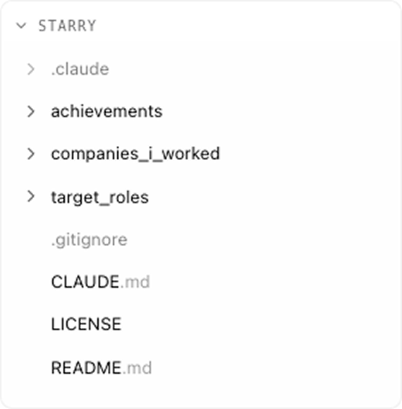

<h1 align="center">Starry</h1>

<p align="center"><strong>Make sense of your career.</strong></p>

<p align="center">A file-first framework for reflecting on your work, mapping it to roles, and turning it into tailored CVs — with any AI assistant. Claude, Cursor, Windsurf, Kojori, ChatGPT.</p>

<p align="center">
  
</p>

---

## Features

- **A structured way to think about your work.** STARR turns "I did some stuff" into stories with cause, action, and outcome — useful for CVs, interviews, and figuring out what you actually want next.
- **Achievements as reusable building blocks.** Capture once as Situation, Task, Action, Result, Reflection. Reuse for every CV.
- **Auto-built company profiles.** Extracted from your achievements. No double entry.
- **Generalised target roles.** Synthesised from 20+ similar job postings, not a single JD.
- **Evidence-based skills mapping.** Match achievements to role requirements with direct quotes from your stories.
- **Tailored CVs.** Generated per role. Every bullet backed by a metric.

## Install

Starry is a folder, not an app. Clone it and open in any AI assistant with file access.

```bash
git clone https://github.com/katilevina/starry.git
```

Then open the folder in:

- **Claude** — Create Project → Upload folder
- **Cursor / Windsurf / Kojori** — Open Workspace
- **ChatGPT** — Upload files or paste `CLAUDE.md` as system prompt

Type `/quick-setup` to begin.

## Workflow

```
/quick-setup       Gather company context        ~3 min
/add-achievement   Capture a STARR story         ~15 min
/analyze-role      Synthesise a target role      ~10 min
/map-skills        Generate a tailored CV        ~5 min
```

Initial setup takes 1–2 hours. Each subsequent CV takes 10 minutes.

## Structure

```
starry/
├── achievements/         What you did
├── companies_i_worked/   Where you did it
├── target_roles/         What you want next
└── .claude/commands/     Automation
```

Achievements and companies are permanent — your history. Target roles are dynamic — built from market analysis. CVs are generated per role.

## Keep it private

This repo is a template. Your career data belongs in a private fork:

```bash
git clone https://github.com/katilevina/starry.git my-starry
cd my-starry
git remote set-url origin git@github.com:YOUR_USERNAME/my-starry.git
git push -u origin main
```

Make sure the new repository is **private**. Your data stays yours.

## Status

Alpha. Core works. Templates and examples are still being refined. Feedback welcome — [open an issue](https://github.com/katilevina/starry/issues).

## License

MIT. See [LICENSE](LICENSE).
